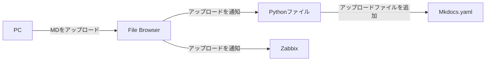

# ■ [情報通信工学基礎実験 自主課題 構築手順書]
([206/09/28])

# 概要
- **目的**: [オンプレクラウド上にアップロードされたMDファイルをHTMLとして閲覧可能にし、一部ファイルに閲覧制限をかける]
- **理由・背景**: [授業課題]
- **前提条件**:
  - 構築対象機器
    - 学校のPC
  - 使用機器
    - 物理機器
      - 
    - ソフト構成
      - Ubuntu 20.04? Desktop
        - Docker
            - File Browser  [ファイル管理]
            - Mkdocs        [MD表示]
            - Zabbix        [監視]
            - Authelia      [アクセス管理]
        - python3



# 参考資料
  - [Ubuntu で Docker のインストール](https://qiita.com/tf63/items/c21549ba44224722f301)
  - [【入門】Dockerの環境構築を解説｜Ubuntuにインストール](https://www.kagoya.jp/howto/cloud/container/dockerubuntu/)
  - [Ubuntu環境でPython環境構築](https://qiita.com/i-am-misaki/items/dcf1ab9a80bbe7be58f0)
  - [これまでのすべての Ubuntu デフォルト壁紙](https://ja.linux-console.net/?p=18131)
  - [Discord認証付きのFileBrowserサーバーをdockerで建てようとして苦難した話 ](https://note.com/_le_ciel_etoile/n/ndb582ff57aa4)
  - [filebrowserの導入メモ](https://qiita.com/tomoworin/items/dfeabe7461088e03ebe0)
  - [Webブラウザ上でファイル操作が可能な「Filebrowser」](https://hirogura.com/post/70315)
  - [MkdocsをDockerで動かしてみた](https://qiita.com/haruto830/items/d5bc9148413d3c5aec04)
  - [WordとPDFによるドキュメント運用を変えたくて、WSL+DockerでMKDocsの環境を立ててみた。](https://qiita.com/ParakeetOnTheHead/items/abaf9d22a6d3cee018d1)
  - [dockerでmkdocs環境を作る](https://zenn.dev/yoshiyasu1111/scraps/d77132dbd37d8e)
# 構築手順
## Dockerをinstall
  - 準備/必要レポジトリのintall
    ```bash
    $ sudo su -
    $ apt update && apt upgrade -y
    $ apt install -y ca-certificates curl gnupg
    ```
  - Docker
    ```bash
    # キーリング保存用ディレクトリの作成（存在しない場合）
    $ install -m 0755 -d /etc/apt/keyrings

    # GPGキーのダウンロードと保存
    $ curl -fsSL https://download.docker.com/linux/ubuntu/gpg | sudo gpg --dearmor -o /etc/apt/keyrings/docker.gpg

    # 読み取り権限の付与
    $ chmod a+r /etc/apt/keyrings/docker.gpg

    # リポジトリリストへの追加
    # 26.04は新しいためDocker公式リポジトリが未対応の場合がある。404なら直前のLTSで代用する
    $ CODENAME=$(. /etc/os-release && echo "$VERSION_CODENAME")
    $ curl -fsI "https://download.docker.com/linux/ubuntu/dists/${CODENAME}/Release" || CODENAME=noble
    $ echo "deb [arch=$(dpkg --print-architecture) signed-by=/etc/apt/keyrings/docker.gpg] https://download.docker.com/linux/ubuntu ${CODENAME} stable" \
      > /etc/apt/sources.list.d/docker.list

    # 新しいリポジトリ情報を反映
    $ apt update
    
    # Docker Engine のインストール
    $ apt install -y docker-ce docker-ce-cli containerd.io docker-buildx-plugin docker-compose-plugin

    # ユーザーグループへ追加
    $ usermod -aG docker aketimaika

    # 反映確認 / 再ログインするかnewgrp
    $ newgrp docker

    # 動作確認
    $ docker --version
    $ docker compose version

    # hello worldコンテナを作動
    $ docker run hello-world

    # 自動起動の設定
    $ systemctl enable docker.service
    $ systemctl enable containerd.service
    ```
## python3をインストール
  - インストールを確認
    ```bash
    $ python3 --version
    ```
  - [インストールされてない場合]インストールを実行
    ```bash
    $ sudo apt install python3.9
    ```
## File BrowserをDockerに構築
  - filebrowserのファイルを保管する場所を構築
    ```bash
    $ mkdir -p "$HOME/filebrowser/database"
    $ mkdir -p "$HOME/filebrowser/config"
    $ mkdir -p "$HOME/files"
    ```
  - Dockerコンテナ上に構築
    ```bash
    $ docker run \
        -v filebrowser_data:/srv \
        -v filebrowser_database:/database \
        -v filebrowser_config:/config \
        -p 8080:80 \
        filebrowser/filebrowser
    ```
  - 初期パスワードを確認
    ```bash
    $ docker ps
    $ docker logs filebrowser
    ```
    adminのPassは最初しか出ないので必ず確認する
  - アクセスを確認
    ```bash
    http://localhost:8080
    ```
    adminと先ほど検索したpassで中に入る  
    接続確認を実施
## MkdocsをDockerに構築
  - 