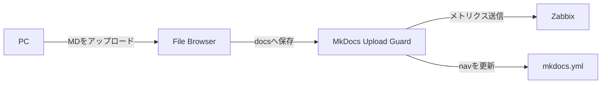

# ■ [情報通信工学基礎実験 自主課題 構築手順書]
([206/09/28])

# 概要
- **目的**: [オンプレクラウド上にアップロードされたMDファイルをHTMLとして閲覧可能にし、一部ファイルに閲覧制限をかける]
- **理由・背景**: [授業課題]
- **前提条件**:
  - 構築対象機器
    - 学校のPC
  - 使用機器
    - 物理機器
      - 
    - ソフト構成
      - Ubuntu 20.04? Desktop
        - Docker
            - File Browser  [ファイル管理]
            - Mkdocs        [MD表示]
            - Zabbix        [監視]
            - ~~Authelia      [アクセス管理]~~ → HTTPSが必須のため今回は断念
            - Nginx         [公開・アクセス管理]
        - python3



# 参考資料
  - [Ubuntu で Docker のインストール](https://qiita.com/tf63/items/c21549ba44224722f301)
  - [【入門】Dockerの環境構築を解説｜Ubuntuにインストール](https://www.kagoya.jp/howto/cloud/container/dockerubuntu/)
  - [Ubuntu環境でPython環境構築](https://qiita.com/i-am-misaki/items/dcf1ab9a80bbe7be58f0)
  - [これまでのすべての Ubuntu デフォルト壁紙](https://ja.linux-console.net/?p=18131)
  - [Discord認証付きのFileBrowserサーバーをdockerで建てようとして苦難した話 ](https://note.com/_le_ciel_etoile/n/ndb582ff57aa4)
  - [filebrowserの導入メモ](https://qiita.com/tomoworin/items/dfeabe7461088e03ebe0)
  - [Webブラウザ上でファイル操作が可能な「Filebrowser」](https://hirogura.com/post/70315)
  - [MkdocsをDockerで動かしてみた](https://qiita.com/haruto830/items/d5bc9148413d3c5aec04)
  - [WordとPDFによるドキュメント運用を変えたくて、WSLDockerでMKDocsの環境を立ててみた。](https://qiita.com/ParakeetOnTheHead/items/abaf9d22a6d3cee018d1)
  - [dockerでmkdocs環境を作る](https://zenn.dev/yoshiyasu1111/scraps/d77132dbd37d8e)
  - [コンテナからのインストール](https://www.zabbix.com/documentation/7.4/jp/manual/installation/containers)
# 構築手順
## Dockerをinstall
  - 準備/必要レポジトリのintall
    ```bash
    $ sudo su -
    $ apt update && apt upgrade -y
    $ apt install -y ca-certificates curl gnupg
    ```
  - Docker
    ```bash
    # キーリング保存用ディレクトリの作成（存在しない場合）
    $ install -m 0755 -d /etc/apt/keyrings

    # GPGキーのダウンロードと保存
    $ curl -fsSL https://download.docker.com/linux/ubuntu/gpg | sudo gpg --dearmor -o /etc/apt/keyrings/docker.gpg

    # 読み取り権限の付与
    $ chmod a+r /etc/apt/keyrings/docker.gpg

    # リポジトリリストへの追加
    # 26.04は新しいためDocker公式リポジトリが未対応の場合がある。404なら直前のLTSで代用する
    $ CODENAME=$(. /etc/os-release && echo "$VERSION_CODENAME")
    $ curl -fsI "https://download.docker.com/linux/ubuntu/dists/${CODENAME}/Release" || CODENAME=noble
    $ echo "deb [arch=$(dpkg --print-architecture) signed-by=/etc/apt/keyrings/docker.gpg] https://download.docker.com/linux/ubuntu ${CODENAME} stable" \
      > /etc/apt/sources.list.d/docker.list

    # 新しいリポジトリ情報を反映
    $ apt update
    
    # Docker Engine のインストール
    $ apt install -y docker-ce docker-ce-cli containerd.io docker-buildx-plugin docker-compose-plugin

    # ユーザーグループへ追加
    $ usermod -aG docker aketimaika

    # 動作確認
    $ docker --version
    $ docker compose version

    # hello worldコンテナを作動
    $ docker run --rm hello-world

    # 自動起動の設定
    $ systemctl enable docker.service
    $ systemctl enable containerd.service
    # rootシェルを抜け、再ログインして docker グループを反映する
    $ exit
    ```
## python3をインストール
  - インストールを確認
    ```bash
    $ python3 --version
    ```
  - [インストールされてない場合]インストールを実行
    ```bash
    $ sudo apt install python3
    ```
## File BrowserをDockerに構築
  - filebrowerを保管する場所を構築
    ```bash
    $ mkdir -p "$HOME/filebrowser"
    ```
  - filebrowserのファイルを保管する場所を構築
    ```bash
    $ mkdir -p "$HOME/filebrowser/database"
    $ mkdir -p "$HOME/filebrowser/config"
    $ mkdir -p "$HOME/Mkdocs/docs"
    ```
  - Dockerコンテナ上に構築
    ```bash
    $ docker run -d \
      --name filebrowser \
      --restart unless-stopped \
      -v "$HOME/Mkdocs/docs:/srv" \
      -v "$HOME/filebrowser/database:/database" \
      -v "$HOME/filebrowser/config:/config" \
      -p 8080:80 \
      filebrowser/filebrowser
    ```
  - 初期パスワードを確認
    ```bash
    $ docker ps
    $ docker logs filebrowser
    ```
    adminのPassは最初しか出ないので必ず確認する
  - アクセスを確認
    ```bash
    http://localhost:8080
    ```
    adminと先ほど検索したpassで中に入る  
    接続確認を実施
## MkdocsをDockerに構築
  - Docker イメージの取得
    ```bash
    $ docker pull squidfunk/mkdocs-material
    ```
  - ワークフォルダの作成
    ```bash
    $ mkdir -p "$HOME/Mkdocs"
    $ docker run --rm -it --user "$(id -u):$(id -g)" -v "$HOME/Mkdocs:/docs" squidfunk/mkdocs-material new .
    $ mkdir -p "$HOME/Mkdocs/docs/private"
    ```
  - MKDocsの設定
    ```bash
    $ ls -al
    $ cd $HOME/Mkdocs
    $ nano "$HOME/Mkdocs/mkdocs.yml"
    ```
    ```bash
    plugins: []
    ```
  - MKdocs を起動
    ```bash
    $ docker network create school-lab
    $ docker run -d \
      --name mkdocs \
      --restart unless-stopped \
      --network school-lab \
      -v "$HOME/Mkdocs:/docs" \
      squidfunk/mkdocs-material
    ```
  - private配下へ閲覧制限を追加
    ```bash
    $ mkdir -p "$HOME/nginx"
    $ nano "$HOME/nginx/nginx.conf"
    ```
    ```bash
    events {}
    http {
      server {
        listen 80;
        location /private/ {
          auth_basic "Restricted";
          auth_basic_user_file /etc/nginx/.htpasswd;
          proxy_pass http://mkdocs:8000;
        }
        location / {
          proxy_pass http://mkdocs:8000;
        }
      }
    }
    ```
  - 認証ユーザーを作成
    ```bash
    $ docker run --rm -it \
      -v "$HOME/nginx:/work" \
      httpd:2.4-alpine \
      htpasswd -c /work/.htpasswd student
    ```
  - Nginxを起動
    ```bash
    $ docker run -d \
      --name school-nginx \
      --restart unless-stopped \
      --network school-lab \
      -p 80:80 \
      -v "$HOME/nginx/nginx.conf:/etc/nginx/nginx.conf:ro" \
      -v "$HOME/nginx/.htpasswd:/etc/nginx/.htpasswd:ro" \
      nginx:alpine
    ```
  - 確認
    ```bash
    公開ページ：http://<サーバーのIPアドレス>/
    制限ページ：http://<サーバーのIPアドレス>/private/
    # private配下で認証画面が表示されることを確認する
    ```
## mkdocsの更新を検知し、mkdocs.yamlを自動更新する
  - コマンドを準備
    ```bash
    $ sudo su -
    $ apt update
    $ apt install -y git python3
    ```
  - フォルダー全体を取得
    ```bash

    DEST="$HOME/mkdocs-upload-guard"
    TEMP_DIR="$(mktemp -d)"
    trap 'rm -rf -- "$TEMP_DIR"' EXIT

    $ git clone \
        --depth 1 \
        --filter=blob:none \
        --sparse \
        "https://github.com/Aketi-Maika/Aketi-School-LAB.git" \
        "$TEMP_DIR/repository"
    
    $ git -C "$TEMP_DIR/repository" \
        sparse-checkout set "MkDocs Upload Guard"
      
    $ install -d -m 0750 "$DEST"

    $ cp -a \
        "$TEMP_DIR/repository/MkDocs Upload Guard/." \
        "$DEST/"
    ```
  - 取得結果を確認
    ```bash
    $ find "$HOME/mkdocs-upload-guard" -maxdepth 1 -type f -printf '%f\n'
    ```
  - 実環境へ変更
    ```bash
    $ cd "$HOME/mkdocs-upload-guard"
    $ cp -n config.example.json config.json
    $ chmod 600 config.json
    $ chmod 750 upload_guard.py

    $ nano config.json
    ```
    ```bash
    "watch_dir": "~/Mkdocs/docs",
    "mkdocs_config": "~/Mkdocs/mkdocs.yml",
    "log_file": "~/mkdocs-upload-guard/upload_guard.log",
    ```
  - 設定とコードを確認
    ```bash
    $ python3 -m json.tool config.json > /dev/null
    $ python3 upload_guard.py \
        --config config.json \
        --check-config
    ```
  - 初回実行
    ```bash
    $ python3 upload_guard.py \
        --config config.json \
        --once
    ```
  - systemdユーザーサービスとして常駐
     ```bash
     $ mkdir -p "$HOME/.config/systemd/user"
     $ nano "$HOME/.config/systemd/user/mkdocs-upload-guard.service"
     ```
     ```ini
     [Unit]
     Description=MkDocs Upload Guard

     [Service]
     Type=simple
     WorkingDirectory=%h/mkdocs-upload-guard
     ExecStart=/usr/bin/python3 %h/mkdocs-upload-guard/upload_guard.py --config %h/mkdocs-upload-guard/config.json
     Restart=on-failure
     RestartSec=5

     [Install]
     WantedBy=default.target
     ```
     ```bash
     $ systemctl --user daemon-reload
     $ systemctl --user enable --now mkdocs-upload-guard.service
     $ sudo loginctl enable-linger "$USER"
     $ systemctl --user status mkdocs-upload-guard.service
     ```
## Zabbixを導入
  - リポジトリをクローン
    ```bash
    $ git clone https://github.com/zabbix/zabbix-docker.git
    ```
  - version 7.4 に切り替え
    ```bash
    $ cd zabbix-docker
    $ git checkout 7.4
    ```
  - デフォルト構成をデプロイ
    ```bash
    $ ZABBIX_WEB_NGINX_HTTP_PORT=8081 docker compose -f ./compose.yaml up -d
    ```
  - Webへログインし、起動を確認
    ```bash
    http://<server_ip_or_name>:8081
    ```
    ```bash
    ID  : Admin
    Pass: zabbix
    ```
## Zabbixで監視を構築
  - Zabbix上にホストとトラッパーアイテムを作成
     - ホスト名: `school-lab`
     - タイプ: `Zabbix trapper`
     - キー:
       - `mkdocs.upload.accepted_total`
       - `mkdocs.upload.deleted_total`
       - `mkdocs.upload.errors_total`
       - `mkdocs.upload.nav_updates_total`
       - `mkdocs.upload.files_current`
       - `mkdocs.upload.last_event_unixtime`
       - `mkdocs.upload.heartbeat`
     - Upload Guardの`config.json`を開き、既存の`zabbix`項目を以下の内容に置き換える
        ```bash
        $ nano "$HOME/mkdocs-upload-guard/config.json"
        ```
        ```json
        "zabbix": {
          "enabled": true,
          "server": "127.0.0.1",
          "port": 10051,
          "host": "school-lab",
          "timeout_seconds": 5,
          "key_prefix": "mkdocs.upload"
        }
        ```
   - 設定反映
     ```bash
     $ systemctl --user restart mkdocs-upload-guard.service
     $ journalctl --user -u mkdocs-upload-guard.service -n 50 --no-pager
     ```
  - Serverにージェントを導入
    - Agentをインストール
      ```bash
      $ UBUNTU_VERSION=$(. /etc/os-release && printf '%s' "$VERSION_ID")
      $ AGENT_SETUP_DIR=$(mktemp -d)
      $ curl -fL \
          "https://repo.zabbix.com/zabbix/7.4/release/ubuntu/pool/main/z/zabbix-release/zabbix-release_7.4-3+ubuntu${UBUNTU_VERSION}_all.deb" \
          -o "$AGENT_SETUP_DIR/zabbix-release.deb" &&
          sudo dpkg -i "$AGENT_SETUP_DIR/zabbix-release.deb" &&
          sudo apt update &&
          sudo apt install -y zabbix-agent2
      ```
    - Agentの設定を編集
      ```bash
      $ sudo nano /etc/zabbix/zabbix_agent2.conf
      # 以下は既存の該当行を変更する。Serverの有効な設定行はコメントアウトする
      ```
      ```bash
      # Server=127.0.0.1
      ServerActive=127.0.0.1:10051
      Hostname=school-lab
      ```
    - 起動と自動起動を設定
      ```bash
      $ sudo systemctl enable zabbix-agent2
      $ sudo systemctl restart zabbix-agent2
      $ sudo systemctl status zabbix-agent2 --no-pager
      ```
    - ZabbixのWeb画面で監視対象を登録
      ```bash
      http://<UbuntuサーバーのIP>:8081
      ```
    「データ収集」→「ホスト」→作成済みの「school-lab」を開く
    「Linux by Zabbix agent active」を追加し、既存のtrapperアイテムを残して更新する
     数分後、「監視データ」→「最新データ」でCPU・メモリ・ディスクの値を確認する
      |項目|設定値|
      |---|---|
      |ホスト名|school-lab|
      |表示名|任意。例：学校実験サーバー|
      |ホストグループ|Linux serversなど|
      |テンプレート|Linux by Zabbix agent active|
      | 監視元|Server|
      | 有効|チェックする
  - Dockerの監視を行う
    - AgentにDockerソケットへのアクセス権を付与
      ```bash
      $ ls -l /var/run/docker.sock
      $ sudo usermod -aG docker zabbix
      $ sudo systemctl restart zabbix-agent2
      $ sudo -u zabbix zabbix_agent2 -c /etc/zabbix/zabbix_agent2.conf -t docker.ping
      $ sudo -u zabbix zabbix_agent2 -c /etc/zabbix/zabbix_agent2.conf -t docker.info
      ```
    - Zabbix ServerからAgentへの接続を設定
      Zabbix Serverコンテナの名前を確認
      ```bash
       $ docker ps --format 'table {{.Names}}\t{{.Image}}\t{{.Ports}}'
      ```
      Zabbix Serverコンテナ名を、上で確認した名前へ置き換える。Webコンテナではなく、イメージが`zabbix/zabbix-server-mysql`のコンテナを選ぶ
      ```bash
       $ ZBX_SERVER_CONTAINER='実際のZabbix Serverコンテナ名'
      $ docker inspect "$ZBX_SERVER_CONTAINER" --format '{{range $name, $net := .NetworkSettings.Networks}}{{printf "%s\t%s\t%s\n" $name $net.IPAddress $net.Gateway}}{{end}}'
      ```
      「ネットワーク名・コンテナIP・Gateway」。公式Composeの`frontend`ネットワーク（例：`zabbix-docker_frontend`。`tools_frontend`とは別）を選び、名前を以下へ設定
      ```bash
      $ ZBX_FRONTEND_NETWORK='実際のfrontendネットワーク名'
      $ docker network inspect "$ZBX_FRONTEND_NETWORK" --format '{{range .IPAM.Config}}{{printf "Subnet=%s Gateway=%s\n" .Subnet .Gateway}}{{end}}'
      ```
      IPv4のSubnetとGatewayを記録
      ```bash
      $ sudo nano /etc/zabbix/zabbix_agent2.conf
      ```
      ```bash
      Server=127.0.0.1,172.16.238.0/24
      ServerActive=127.0.0.1:10051
      Hostname=school-lab
      ListenIP=0.0.0.0
      ListenPort=10050
      ```
      ```bash
      $ sudo systemctl restart zabbix-agent2
      $ sudo systemctl status zabbix-agent2 --no-pager
      $ sudo ss -lntp 'sport = :10050'
      $ sudo ufw status
      ```
    - frontendサブネットからホストGatewayへの通信を許可
      ```bash
      $ sudo ufw allow from 172.16.238.0/24 to 172.16.238.1 port 10050 proto tcp
      ```
    - Serverコンテナから取得できることを確認
      ```bash
      $ docker exec "$ZBX_SERVER_CONTAINER" zabbix_get -s 172.16.238.1 -p 10050 -k docker.ping
      ```
    - Dockerテンプレートを既存ホストへ追加
      Zabbix Webの「データ収集」→「ホスト」→`school-lab`を開く。

    | 項目 | 設定 |
    |---|---|
    | テンプレート | `Docker by Zabbix agent 2`を追加 |
    | 既存テンプレート | `Linux by Zabbix agent active`を残す |
    | Agentインターフェース | 追加し、IPへ確認したGateway（例：`172.16.238.1`）を設定 |
    | 接続方法／ポート | IP／`10050` |
    | 監視元 | Server |
  - MkDocs Upload Guardの監視を構築
    - Upload Guardの稼働プロセスを監視
      Upload Guardを登録した一般ユーザーで確認
      ```bash
      $ systemctl --user status mkdocs-upload-guard.service --no-pager
      $ journalctl --user -u mkdocs-upload-guard.service -n 50 --no-pager
      ```

    - `school-lab`の「アイテム」で以下を作成
      | 項目 | 設定 |
      |---|---|
      | 名前 | `MkDocs Upload Guard: プロセス数` |
      | タイプ | Zabbixエージェント（アクティブ） |
      | キー | `proc.num[python3,,,"upload_guard[.]py"]` |
      | データ型 | 数値（整数・符号なし） |
      | 更新間隔 | `30s` |

    - 同じホストに次のトリガーを作成
      | 名前 | 深刻度 | 条件式 |
      |---|---|---|
      | Upload Guard: プロセス停止 | 軽度の障害 | `max(/school-lab/proc.num[python3,,,"upload_guard[.]py"],2m)=0` |
      | Upload Guard: 二重起動 | 警告 | `min(/school-lab/proc.num[python3,,,"upload_guard[.]py"],2m)>1` |
    - Upload Guardのハートビート・処理結果を監視

      既存の`school-lab`に登録済みの7個のtrapperアイテムを確認  
      同じキーのアイテムは追加せず編集する。

      共通設定は「タイプ：Zabbix trapper」「データ型：数値（整数・符号なし）」「有効」。受信した値をそのまま保存し、差分や毎秒差分の前処理は設定しない。heartbeatにも「変化なしを破棄」は設定しない。

      | キー | 意味 | 単位 |
      |---|---|---|
      | `mkdocs.upload.accepted_total` | 起動後に受付・再検査した回数 | 空欄 |
      | `mkdocs.upload.deleted_total` | 起動後に自動削除した回数 | 空欄 |
      | `mkdocs.upload.errors_total` | 起動後の検査・削除・nav更新等のエラー回数 | 空欄 |
      | `mkdocs.upload.nav_updates_total` | 起動後のnav更新回数 | 空欄 |
      | `mkdocs.upload.files_current` | 監視スキャンで数えた現在のファイル数 | 空欄 |
      | `mkdocs.upload.last_event_unixtime` | 最後のファイルイベント時刻 | `unixtime` |
      | `mkdocs.upload.heartbeat` | ハートビートの送信時刻 | `unixtime` |

      Upload Guardを登録したユーザーで設定を開く。
      ```bash
      $ nano "$HOME/mkdocs-upload-guard/config.json"
      ```
      ```json
      "heartbeat_seconds": 60,
      "zabbix": {
        "enabled": true,
        "server": "127.0.0.1",
        "port": 10051,
        "host": "school-lab",
        "timeout_seconds": 5,
        "key_prefix": "mkdocs.upload"
      }
      ```

      ```bash
      $ python3 -m json.tool "$HOME/mkdocs-upload-guard/config.json" > /dev/null
      $ python3 "$HOME/mkdocs-upload-guard/upload_guard.py" --config "$HOME/mkdocs-upload-guard/config.json" --check-config
      $ systemctl --user restart mkdocs-upload-guard.service
      $ journalctl --user -u mkdocs-upload-guard.service -n 50 --no-pager
      ```
    - 次のトリガーを`school-lab`に追加

      | 名前 | 深刻度 | 条件式 |
      |---|---|---|
      | Upload Guard: ハートビート受信途絶 | 軽度の障害 | `nodata(/school-lab/mkdocs.upload.heartbeat,3m)=1` |
      | Upload Guard: 処理エラー発生 | 警告 | `changecount(/school-lab/mkdocs.upload.errors_total,5m,"inc")>0` |
      | Upload Guard: 未許可ファイルを削除 | 情報 | `changecount(/school-lab/mkdocs.upload.deleted_total,5m,"inc")>0` |

  ## 監視の動作確認
  - 検知と復旧を確認

      以下は短時間の停止を伴う確認。授業用の実験時間に実施し、復旧コマンドまで実行する。

      Upload Guardについて、まずheartbeatが正常に届いていることを確認してから停止する。

      ```bash
      $ systemctl --user stop mkdocs-upload-guard.service
      ```

      数分待ち、「監視データ」→「障害」でプロセス停止とheartbeat途絶を確認する。確認後は起動する。

      ```bash
      $ systemctl --user start mkdocs-upload-guard.service
      ```

      プロセス数が1へ戻り、heartbeatが更新され、障害が復旧することを確認する。稼働中に手動の`python3 upload_guard.py`や`--once`を並行実行しない。

      Dockerは自動検出と停止トリガーの作成後、File Browserだけを停止して確認する。

      ```bash
      $ docker stop filebrowser
      ```

      `filebrowser`の`Running`が0となり、追加した停止トリガーが発生することを確認して復旧する。

      ```bash
      $ docker start filebrowser
      ```

      `Running`が1へ戻り障害が復旧することを確認する。Zabbix ServerやDBコンテナ、Dockerデーモン自体をこの試験で停止しない。

      処理監視は、File Browserから新しいテスト用`.md`をアップロードし、受付・nav更新カウンターと画面反映を確認する。自動削除は、既存ファイルと名前が重複しない使い捨てのテスト用`.bin`をアップロードし、ファイル削除、`deleted_total`増加、情報イベントを確認する。削除されたテストファイルはUpload Guardから復元できない。