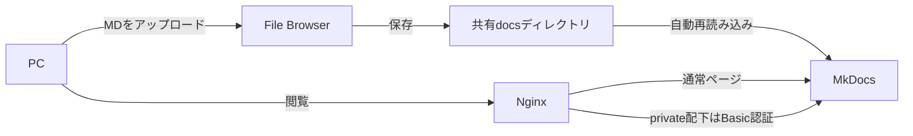

# ■ [情報通信工学基礎実験 自主課題 構築手順書]
(2026/09/28)

# 概要
- **目的**: [オンプレクラウド上にアップロードされたMDファイルをHTMLとして閲覧可能にし、一部ファイルに閲覧制限をかける]
- **理由・背景**: [授業課題]
- **前提条件**:
  - 構築対象機器
    - 学校のPC
  - 使用機器
    - 物理機器
      - 
    - ソフト構成
      - Ubuntu 26.04 LTS Desktop（64-bit）
        - Docker
            - File Browser  [ファイル管理]
            - Mkdocs        [MD表示]
            - Nginx         [公開・アクセス管理]

> [!NOTE]
> 本手順は授業用の閉域ネットワークを対象とする。File Browserは保守終了済みのため、インターネットへは公開しないこと。



# 参考資料
  - [Ubuntu で Docker のインストール](https://qiita.com/tf63/items/c21549ba44224722f301)
  - [【入門】Dockerの環境構築を解説｜Ubuntuにインストール](https://www.kagoya.jp/howto/cloud/container/dockerubuntu/)
  - [Ubuntu環境でPython環境構築](https://qiita.com/i-am-misaki/items/dcf1ab9a80bbe7be58f0)
  - [これまでのすべての Ubuntu デフォルト壁紙](https://ja.linux-console.net/?p=18131)
  - [Discord認証付きのFileBrowserサーバーをdockerで建てようとして苦難した話 ](https://note.com/_le_ciel_etoile/n/ndb582ff57aa4)
  - [filebrowserの導入メモ](https://qiita.com/tomoworin/items/dfeabe7461088e03ebe0)
  - [Webブラウザ上でファイル操作が可能な「Filebrowser」](https://hirogura.com/post/70315)
  - [MkdocsをDockerで動かしてみた](https://qiita.com/haruto830/items/d5bc9148413d3c5aec04)
  - [WordとPDFによるドキュメント運用を変えたくて、WSL+DockerでMKDocsの環境を立ててみた。](https://qiita.com/ParakeetOnTheHead/items/abaf9d22a6d3cee018d1)
  - [dockerでmkdocs環境を作る](https://zenn.dev/yoshiyasu1111/scraps/d77132dbd37d8e)
# 構築手順
## Dockerをインストール
  - 準備/必要パッケージのインストール
    ```bash
    $ sudo apt update
    $ sudo apt install -y ca-certificates curl gnupg
    ```
  - Docker
    ```bash
    # キーリング保存用ディレクトリの作成（存在しない場合）
    $ sudo install -m 0755 -d /etc/apt/keyrings

    # GPGキーのダウンロードと保存
    $ curl -fsSL https://download.docker.com/linux/ubuntu/gpg | sudo gpg --dearmor -o /etc/apt/keyrings/docker.gpg

    # 読み取り権限の付与
    $ sudo chmod a+r /etc/apt/keyrings/docker.gpg

    # リポジトリリストへの追加
    $ CODENAME=$(. /etc/os-release && echo "$VERSION_CODENAME")
    $ echo "deb [arch=$(dpkg --print-architecture) signed-by=/etc/apt/keyrings/docker.gpg] https://download.docker.com/linux/ubuntu ${CODENAME} stable" \
      | sudo tee /etc/apt/sources.list.d/docker.list > /dev/null

    # 新しいリポジトリ情報を反映
    $ sudo apt update
    
    # Docker Engine のインストール
    $ sudo apt install -y docker-ce docker-ce-cli containerd.io docker-buildx-plugin docker-compose-plugin

    # ユーザーグループへ追加
    $ sudo usermod -aG docker "$USER"

    # 反映確認 / 実行後はログアウト・ログインを推奨
    $ newgrp docker

    # 動作確認
    $ docker --version
    $ docker compose version

    # hello worldコンテナを作動
    $ docker run hello-world

    # 自動起動の設定
    $ sudo systemctl enable docker.service
    $ sudo systemctl enable containerd.service
    ```
## File BrowserをDockerに構築
  - File Browserを保管する場所を構築
    ```bash
    $ mkdir -p "$HOME/filebrowser"
    ```
  - filebrowserのファイルを保管する場所を構築
    ```bash
    $ mkdir -p "$HOME/filebrowser/database"
    $ mkdir -p "$HOME/filebrowser/config"
    $ mkdir -p "$HOME/Mkdocs/docs"
    ```
  - Dockerコンテナ上に構築
    ```bash
    $ docker run -d \
        --name filebrowser \
        --restart unless-stopped \
        -v "$HOME/Mkdocs/docs:/srv" \
        -v "$HOME/filebrowser/database:/database" \
        -v "$HOME/filebrowser/config:/config" \
        -p 8080:80 \
        filebrowser/filebrowser
    ```
  - 初期パスワードを確認
    ```bash
    $ docker ps
    $ docker logs filebrowser
    ```
    adminの初期パスワードは最初しか出ないので必ず確認する。
  - アクセスを確認
    ```bash
    http://<サーバーのIPアドレス>:8080
    ```
    adminと先ほど確認したパスワードでログインし、直ちに管理者パスワードを変更する。
    File Browserでは`docs`直下を公開用、`docs/private`を制限用として使用する。
## MkDocsをDockerに構築
  - Docker イメージの取得
    ```bash
    $ docker pull squidfunk/mkdocs-material
    ```
  - ワークフォルダの作成
    ```bash
    $ mkdir -p "$HOME/Mkdocs"
    $ docker run --rm -it -v "$HOME/Mkdocs:/docs" squidfunk/mkdocs-material new .
    $ mkdir -p "$HOME/Mkdocs/docs/private"
    ```
  - MkDocsの設定
    ```bash
    $ cd "$HOME/Mkdocs"
    $ nano mkdocs.yml
    ```
    `mkdocs.yml`を以下の内容にする。
    ```yaml
    site_name: 情報通信工学基礎実験
    theme:
      name: material
    ```
    制限ページを作成する。
    ```bash
    $ nano "$HOME/Mkdocs/docs/private/index.md"
    ```
  - MkDocsを起動
    ```bash
    $ docker network create school-lab
    $ docker run -d \
        --name mkdocs \
        --restart unless-stopped \
        --network school-lab \
        -v "$HOME/Mkdocs:/docs" \
        squidfunk/mkdocs-material
    ```
## Nginxで閲覧制限を設定
  - 設定ファイルを保管する場所を作成
    ```bash
    $ mkdir -p "$HOME/nginx"
    $ nano "$HOME/nginx/nginx.conf"
    ```
    `nginx.conf`を以下の内容にする。`private`配下だけBasic認証を要求する。
    ```nginx
    events {}

    http {
      server {
        listen 80;

        location /private/ {
          auth_basic "Restricted";
          auth_basic_user_file /etc/nginx/.htpasswd;
          proxy_pass http://mkdocs:8000;
        }

        location / {
          proxy_pass http://mkdocs:8000;
        }
      }
    }
    ```
  - 閲覧用ユーザーを作成
    ```bash
    $ docker run --rm -it \
        -v "$HOME/nginx:/work" \
        httpd:2.4-alpine \
        htpasswd -c /work/.htpasswd student
    ```
    表示された入力欄へ閲覧用パスワードを設定する。
  - Nginxを起動
    ```bash
    $ docker run -d \
        --name school-nginx \
        --restart unless-stopped \
        --network school-lab \
        -p 80:80 \
        -v "$HOME/nginx/nginx.conf:/etc/nginx/nginx.conf:ro" \
        -v "$HOME/nginx/.htpasswd:/etc/nginx/.htpasswd:ro" \
        nginx:alpine
    ```
## 動作確認
  - コンテナの状態を確認
    ```bash
    $ docker ps
    $ docker logs filebrowser
    $ docker logs mkdocs
    $ docker logs school-nginx
    ```
  - 公開ページを確認
    ```text
    http://<サーバーのIPアドレス>/
    ```
  - 制限ページを確認
    ```text
    http://<サーバーのIPアドレス>/private/
    ```
    制限ページでは認証画面が表示され、作成したユーザーだけが閲覧できることを確認する。
  - File Browserから`index.md`または`private/index.md`を更新し、ブラウザの再読み込み後に内容が反映されることを確認する。
